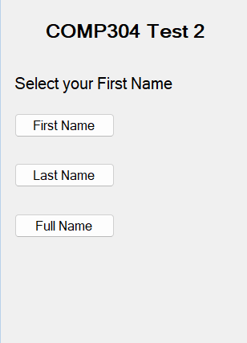

# Hands-On TEST 2

This hands-on test **must be completed individually** by all the students. **DO NOT** give your solution to others, otherwise there will be serious consequences. See College Academic Policy

## Exercise #1

Create an Android app that allows users to attend a Quiz. In the Main
activity first question is displayed with answers. User will choose the
answer. Score gets added for every correct answer. There are three
questions in the Quiz. You may highlight the answer in Green color if
answered correctly. After highlighting the answer, the score is
displayed in the Toast Message as:

For correct answer- \> **Hi\<your last name\> your score is 1 out of 3**

For incorrect answer-\> **Hi\<your last name\> your score is 0 out of
3**

After showing the Toast message Second question is displayed with
answers. Answer selection, highlighting the answer and Score display as
Toast messages are done for Second and Third question.

Refer the sample layout, Question and answers template for the First
Question.

The answers of the first question should display your First name, Last
Name and Full Name as answers. In the Toast message your last name
should be displayed along with the score.

Refer the sample layout, Question and answers template for the First
Question.

The answers of the second question should display your First name, Last
Name and Full Name as answers.

Refer the sample layout, Question and answers template for the Third
Question.

Use your Student number, its previous and next numbers as answers to the
third question
